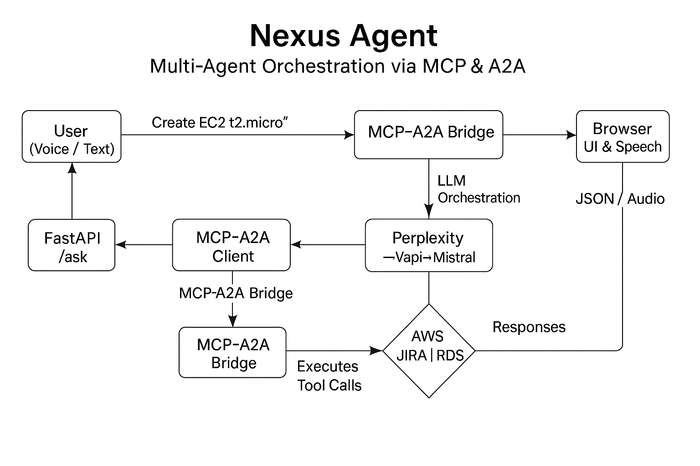
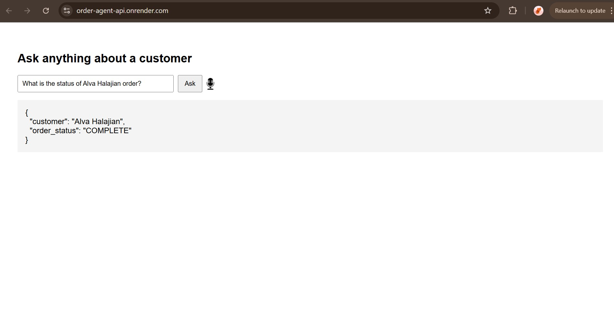

# 🚀 Nexus Agent  
### *Multi-Agent Orchestration via MCP & A2A*  
**Top 6 of 57 ** @ **MCP & A2A Hackathon – AWS Edition** • Creators Corner @ AWS GenAI Loft, SF  

[](https://lnkd.in/gMKTiyKu)  
[](https://fastapi.tiangolo.com/)  
[](https://aws.amazon.com/ec2/)  
[](LICENSE)

---

## 🎯 Project Overview

**Nexus Agent** is a conversational cloud-ops platform where multiple AI agents collaborate—like a human team—via the Agent-to-Agent (A2A) protocol and Model Context Protocol (MCP). Users can:

- 🔄 **Delegate workflows** through an A2A/MCP bridge  
- ☁️ **Automate AWS**: launch/terminate EC2, snapshot volumes  
- 🗂️ **Manage Tickets**: create and update JIRA issues  
- 📊 **Query Data**: fetch and filter RDS order records  
- 🔍 **Observe & Debug**: trace agent decisions in real time  

**🧠 AI Customer Order Agent** is a part of it where we can anything about your customers' orders in natural language—by voice or text—and instantly get the latest status, totals, dates, or any other field you need. Features are:
- 🔄**Voice & Text Input**  
  Leverage the Web Speech API for seamless "click-to-talk" queries, or type any question in the browser.
- 🗂️**Multi-LLM Extraction**  
  First tries your custom MCP–A2A bridge (Perplexity/Vapi.ai agent under the hood), then falls back to Mistral if needed.
- 🔍**Dynamic Field Lookup**  
    Your query can ask for **any** column—status, total, rating, items, address, etc.—and the agent will map your phrasing to the correct database field.
- 📊**AWS RDS Integration**  
  Safely fetches your customer_orders from a managed PostgreSQL instance.
- ☁️**Cloud-native Deployment**  
    Two Render web services—one for the **MCP–A2A bridge**, one for the **FastAPI app**—guarantee zero-downtime, public HTTPS endpoints, and automatic rebuilds on git push.
---

## 🏆 Hackathon Highlights

- **Event**: MCP & A2A Hackathon – AWS Edition  
- **Host**: Creators Corner @ AWS GenAI Loft  
- **Team Nexus Agent**  
  - **Amrutha Junnuri** (You!)  
  - Chandini Saisri Uppuganti  
  - Kiran  
> “Nexus Agent pushed the boundaries of multi-agent orchestration—automating cloud operations, ticketing, and data retrieval in a single, conversational UX.”  

📄 Devpost: [bit.ly/devpost-m2](https://lnkd.in/gMKTiyKu)  
▶️ Demo: [youtu.be/g2bduyiW](https://lnkd.in/g2bduyiW)  

---

## 🏗️ Architecture & Workflow

1️⃣ **Client** (Browser UI & Speech)  
2️⃣ **FastAPI** `/ask` endpoint  
3️⃣ **A2A Client** (MCP–A2A SDK in Python)  
4️⃣ **Bridge** (Node MCP‐A2A server on Render)  
5️⃣ **LLM Orchestration** (Perplexity → Vapi → Mistral)  
6️⃣ **Tools** (AWS, JIRA, RDS)  
7️⃣ **Response** back to UI via JSON (or audio in voice mode)

<p align="center">
  
</p>

---

## 🧩 Components

### 1. AWS EC2 Manager  
Create/terminate EC2 instances via natural language.

**Tools:**  
- `initiate_ec2_instance`  
- `terminate_ec2_instance`  

### 2. Order Status Manager  
Query and update customer order status in AWS RDS.

**Tools:**  
- `get_order_status`  
- `list_all_orders`  
- `update_order_status`  

### 3. JIRA Ticket Assistant  
Simulate ticket creation, comments, and status updates.

**Tools:**  
- `create_jira_ticket`  
- `update_jira_ticket`  

### 4. AWS Advisor via Perplexity  
Get cloud advice via LLMs with fallback (Perplexity → Mistral).

---

## 🚀 Getting Started

### Prerequisites

- Python 3.11+  
- AWS account with EC2 permissions  
- PostgreSQL instance (RDS)  
- Perplexity API Key  
- Vapi.ai API Key  

### Environment Setup

#### 1. Clone the repo:
```bash
git clone https://github.com/Amrutha-J822/MCP-A2A-OrderAgent-CLI.git
cd MCP-A2A-OrderAgent-CLI

```
---

#### 2. Create .env with:
```
# RDS / PostgreSQL
DB_HOST=...
DB_PORT=5432
DB_NAME=...
DB_USER=...
DB_PASSWORD=...

# AWS EC2
AWS_ACCESS_KEY_ID=...
AWS_SECRET_ACCESS_KEY=...
AWS_REGION=...

# LLM & Voice
PERPLEXITY_API_KEY=...
VAPI_API_KEY=...

# MCP–A2A bridge (Render)
A2A_MCP_URL=https://mcp-a2a-bridge.onrender.com

```
#### 3. Create .env with:
```
pip install -r requirements.txt

```
#### 4. Deploy the bridge (in /mcp-a2a) separately on Render with:
```
A2A_ENDPOINT_URL=https://<your-api>.onrender.com/vapi-webhook

```
---

## 💻 Running Locally

### FastAPI Server:
```
uvicorn app.main:app --reload

```
- /ask: for text queries
- /vapi-webhook: for voice from Vapi
---

## 🖇️Using the A2A Client
#### 1. Clone the A2A SDK:
```
git clone https://github.com/google/A2A.git mcp-a2a

```
#### 2. Run the A2A bridge:
```
cd mcp-a2a
npm install
npm start

```
#### 3. Ensure your .env or Render environment has:
```
A2A_MCP_URL=https://mcp-a2a-bridge.onrender.com
```
---
## Project Structure
```
├── api/                     # Optional Lambda-style endpoints
├── app/
│   ├── agent.py             # Main processing logic
│   ├── events.py            # Amazon Events ingestion
│   ├── main.py              # FastAPI setup
│   └── voice.py             # Vapi.ai voice handler
├── data/
│   └── customer_orders.csv.xlsx
├── mcp-a2a/                 # MCP-A2A bridge (NodeJS)
│   ├── package.json
│   └── index.ts
├── images/
│   ├── architecture.png
│   └── output1.jpg
├── requirements.txt
└── .env
```
---
## 🖼️ Sample Interaction

```
“What is the status of Alva Halajian order?”

<p align="center">  </p>
```

```
{
  "customer": "Alva Halajian",
  "order_status": "COMPLETE"
}
```
---
## 📚 Resources

- [A2A Protocol Repository](https://github.com/google/A2A)
- [OpenAI Agents Documentation](https://platform.openai.com/docs/assistants/overview)
- [MCP Protocol Documentation](https://github.com/microsoft/mcp)
- [Vapi ](https://docs.vapi.ai/sdk/mcp-server)
---
## 🙋🏼‍♀️ My Contribution
- Architected the full A2A → MCP → RDS pipeline
- Built the FastAPI backend with /ask and /vapi-webhook endpoints
- Integrated Perplexity, Vapi.ai, and Mistral for field extraction
- Deployed MCP-A2A bridge + FastAPI app to Render
- Added dynamic SQL mapping logic for field detection
- Connected and tested voice-to-order via Vapi end-to-end
- Created architecture diagram + sample output JSON
---
##MIT Licensed • Built with ❤️ by Team Nexus Agent


